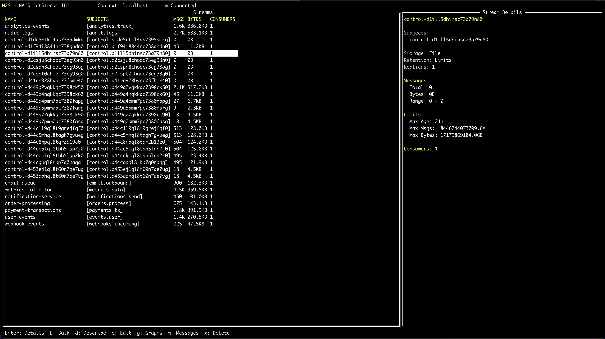

<h1 align="center">
  <br>
  <pre>
 ____  _____   _____    ______   
|_   \|_   _| / ___ `..' ____ \  
  |   \ | |  |_/___) || (___ \_| 
  | |\ \| |   .'____.' _.____`.  
 _| |_\   |_ / /_____ | \____) | 
|_____|\____||_______| \______.' 
  </pre>
  NATS JetStream TUI
  <br>
</h1>

<h4 align="center">Like k9s, but for NATS</h4>

<p align="center">
  <a href="https://opensource.org/licenses/MIT">
    
  </a>
  <a href="https://go.dev/">
    
  </a>
  <a href="https://nats.io/">
    
  </a>
</p>

<p align="center">
  <em>A fast, keyboard-driven terminal UI for managing NATS JetStream streams and consumers</em>
</p>

<p align="center">
  <a href="#features">Features</a> •
  <a href="#installation">Installation</a> •
  <a href="#quick-start">Quick Start</a> •
  <a href="docs/SCREENSHOTS.md">Screenshots</a> •
  <a href="#contributing">Contributing</a>
</p>

---




## Features

- **Multi-context support** - Switch between dev, staging, prod servers
- **Stream management** - List, describe, edit, delete, purge streams
- **Consumer management** - View, edit, delete consumers  
- **Message browser** - Inspect messages with full payload view
- **Bulk operations** - Delete/purge multiple streams at once
- **Prometheus metrics** - Visualize stream/consumer metrics via plugin
- **Real-time updates** - Auto-refresh every 2 seconds
- **Vim-style navigation** - j/k to move, / to filter
- **Read-only mode** - Safe production monitoring
- **Fast filtering** - Real-time search across streams

See [screenshots](docs/SCREENSHOTS.md) for visual tour.

## Installation

```bash
go install github.com/shubhamrasal/n2s/cmd/n2s@latest
```

Or install with Homebrew:

```bash
brew install shubhamrasal/tap/n2s
```

Or build from source:

```bash
git clone https://github.com/shubhamrasal/n2s.git
cd n2s
make build
```

Binary will be at `bin/n2s`.

## Quick Start

```bash
# Connect to local NATS
n2s

# Connect to specific server
n2s --server nats://prod.example.com:4222

# Read-only mode
n2s --read-only
```

Press `?` for help, `c` to switch contexts, `Ctrl+C` to quit.

## Configuration

Create `~/.config/n2s/config.yaml`:

```yaml
contexts:
  - name: dev
    server: nats://localhost:4222
  - name: prod
    server: nats://prod.example.com:4222
    creds: /path/to/nats.creds
    metrics_plugin: prod-prometheus

default_context: dev
refresh_interval: 2s
```

**Default path**: `~/.config/n2s/config.yaml`

See [config-examples/config.yaml](config-examples/config.yaml) for all options.

## Plugins (Optional)

n2s supports Prometheus metrics via plugin system.

Create `~/.config/n2s/plugins.yaml`:

```yaml
plugins:
  - name: prod-prometheus
    type: prometheus
    enabled: true
    url: https://prometheus.example.com
    username: admin
    password: secret
    refresh_interval: 1m
    time_range: 1h
    labels:
      cluster: nats-prod
```

**Default path**: `~/.config/n2s/plugins.yaml`

Press `g` on any stream to view metrics graphs.

See [config-examples/plugins.yaml](config-examples/plugins.yaml) for all options.

## Keybindings

### Global
- `?` - Help
- `j/k` or `↑/↓` - Navigate
- `/` - Filter
- `c` - Switch context
- `r` - Refresh
- `Esc` - Back/Cancel
- `Ctrl+C` - Quit

### Stream List
- `Enter` - View stream details
- `d` - Describe stream (full config)
- `e` - Edit stream
- `m` - View messages
- `b` - Bulk operations (delete/purge multiple)
- `x` - Delete stream
- `p` - Purge stream messages
- `g` - View Prometheus metrics

### Stream Details
- `Enter` - View consumer details
- `e` - Edit consumer
- `x` - Delete consumer

### Message View
- `Enter` - View full message payload

See [docs/KEYBINDINGS.md](docs/KEYBINDINGS.md) for complete reference.

## Contributing

Found a bug? Want a feature? 

- **Issues**: Report bugs or request features at [github.com/shubhamrasal/n2s/issues](https://github.com/shubhamrasal/n2s/issues)
- **Pull Requests**: All PRs welcome, no contribution too small
- **Discussions**: Questions? Start a discussion

Before submitting PRs, run:

```bash
make test
make build
```

## Development

### Setup test environment

```bash
# Start NATS server with demo data
make setup

# Run n2s
make run

# Stop test environment
make teardown
```

Test environment includes NATS server with 3 streams, 3 consumers, and 180 messages.

### Requirements

- Go 1.24+
- Docker (for test environment)

## License

MIT

## Acknowledgments

Built with [tview](https://github.com/rivo/tview) and [nats.go](https://github.com/nats-io/nats.go). Inspired by [k9s](https://k9scli.io/).

