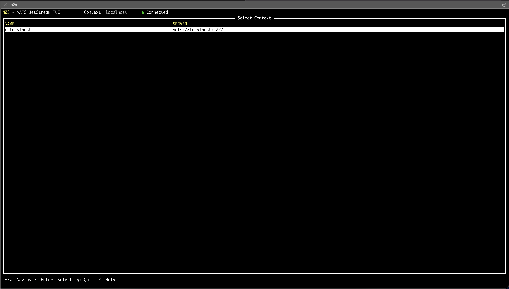
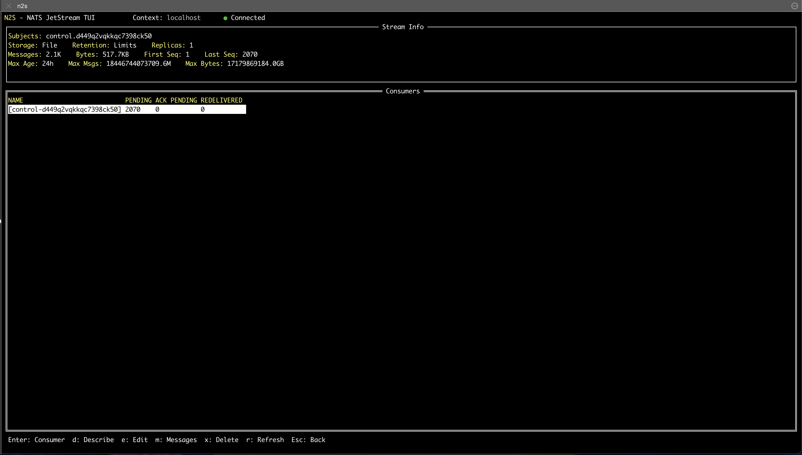
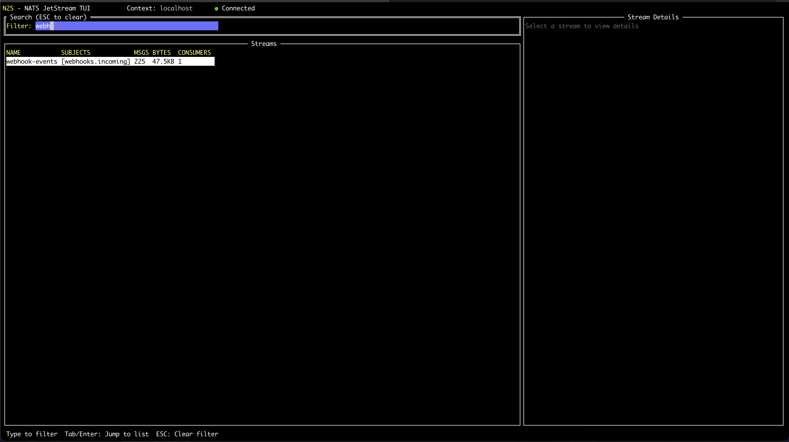
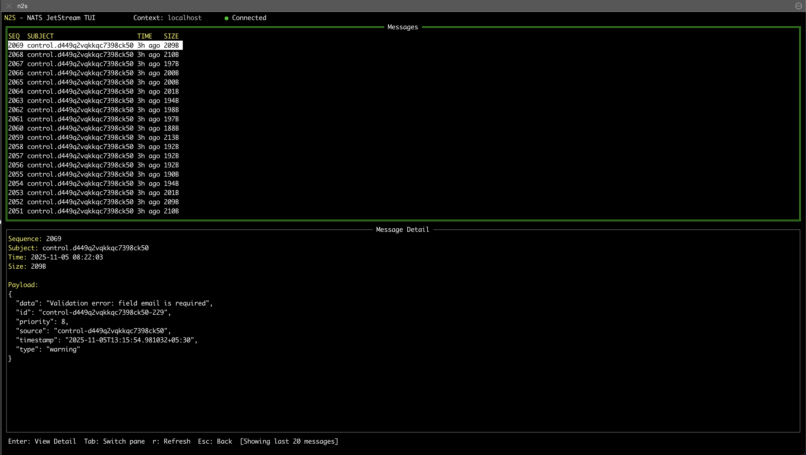
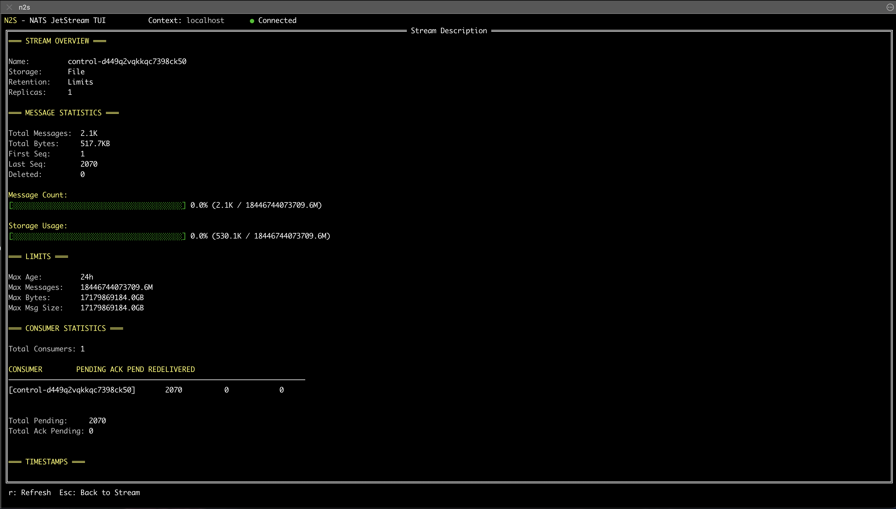
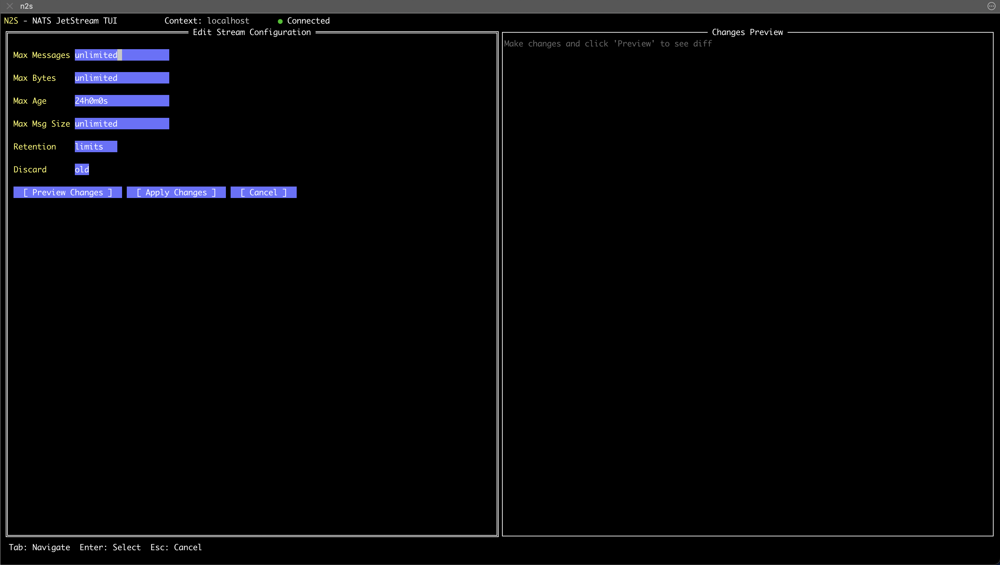
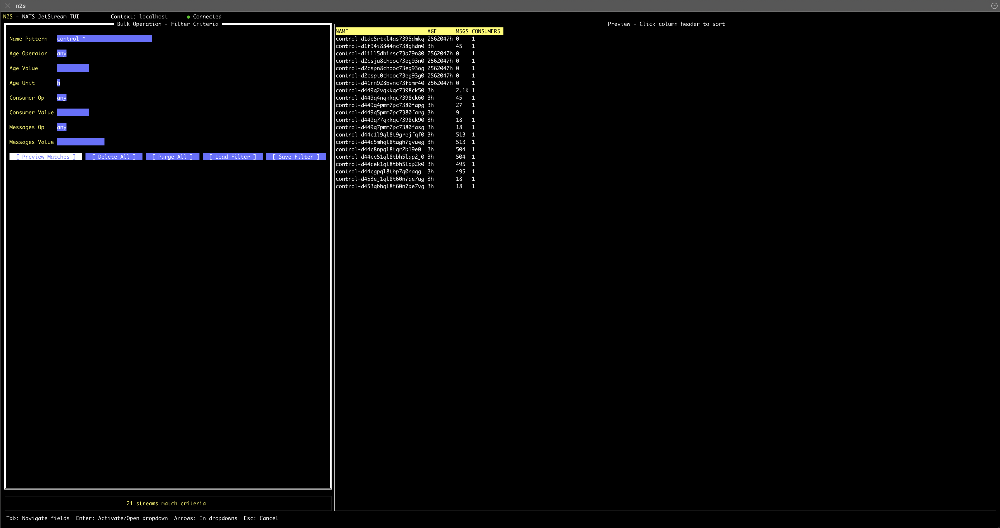
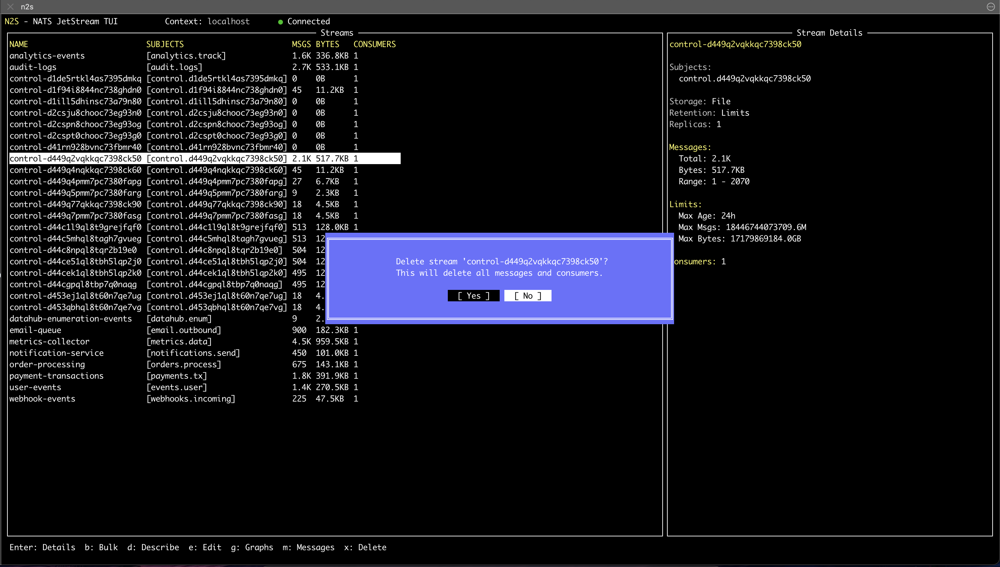

# Screenshots

Visual tour of n2s features.

## Context Switching

Switch between multiple NATS servers (dev, staging, prod).

---

## Stream List

View all streams with subjects, message counts, sizes, and consumer counts. Press `/` to filter.

---

## Consumer Details

Monitor consumer metrics including pending messages, acks, and redeliveries.

---

## Filtering

Filter streams in real-time.

---

## Message Browser

Browse and inspect messages with full payload view.

---

## Stream Description

View complete stream configuration with subjects, storage, retention, and limits.

---

## Stream Edit

Edit stream configuration directly from the TUI.

---

## Bulk Operations

Delete or purge multiple streams at once.

---

## Delete Confirmation

Safety prompts for destructive operations.

---

## Prometheus Metrics

Visualize consumer and stream metrics over time (requires Prometheus plugin).

---

## Navigation Tips

- Use `j/k` or arrow keys to navigate
- Press `/` to filter streams in real-time
- Press `?` anywhere for help
- Press `c` to switch contexts
- Press `r` to refresh
- All destructive operations require confirmation

